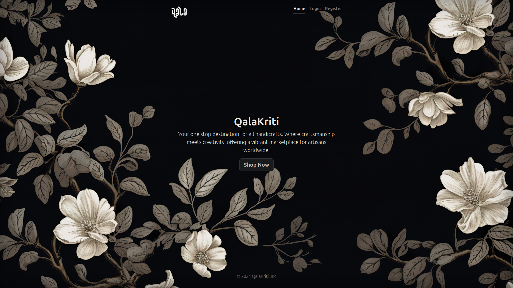
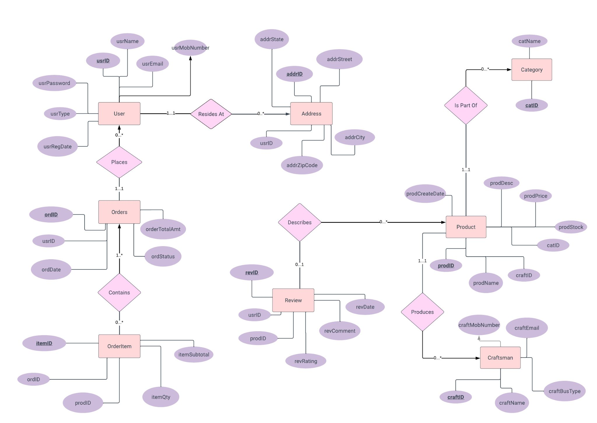
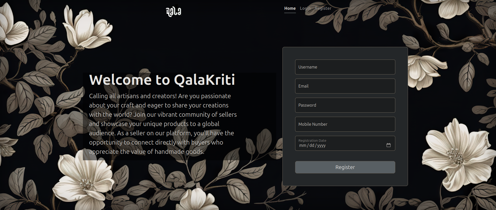
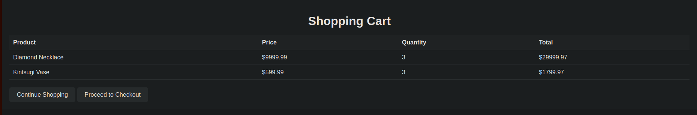
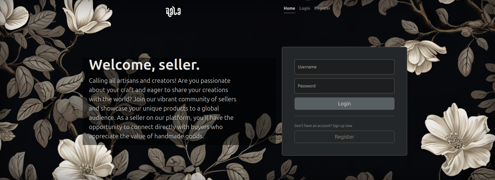
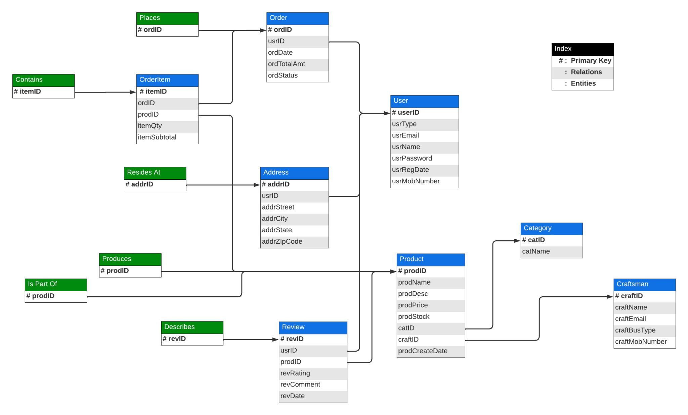
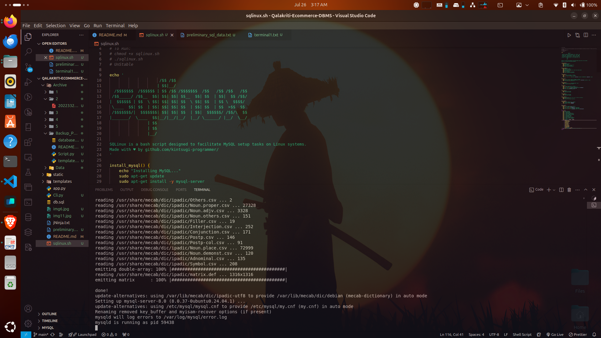

Here's a revised `README.md` that includes a section about the toolkit you've provided, along with the updated information on the two products:

---

# QalaKriti E-Commerce Platform

## Table of Contents

- [QalaKriti E-Commerce Platform](#qalakriti-e-commerce-platform)
  - [Table of Contents](#table-of-contents)
  - [Introduction](#introduction)
  - [Key Features](#key-features)
    - [Admin Panel](#admin-panel)
    - [Customer Experience](#customer-experience)
    - [Craftsman Features](#craftsman-features)
  - [Technologies Used](#technologies-used)
  - [Installation and Setup](#installation-and-setup)
  - [Products](#products)
  - [Toolkit](#toolkit)
    - [SQLinux Script](#sqlinux-script)
      - [Usage](#usage)
      - [Features](#features)

## Introduction

**QalaKriti** is a sophisticated e-commerce platform designed to feature and sell handcrafted treasures from artisans across India.Our goal is to celebrate and preserve traditional craftsmanship by offering a space where artisans can display their unique creations and share their stories with a global audience. Combining advanced database management principles with modern web technologies, QalaKriti offers a robust and scalable solution for showcasing and purchasing unique handcrafted items.




- **Advanced Database Management**: Utilizes MySQL for efficient data handling, including normalization, indexing, and complex querying to ensure data integrity and performance.

- **Dynamic Product Catalog**: Organizes products into categories with detailed descriptions and real-time inventory management for an enhanced user experience.

- **Secure and Scalable Backend**: Built with Python and Flask, providing secure authentication, encryption, and role-based access control.

- **Responsive Design**: Uses HTML, CSS, and Bootstrap to ensure a seamless experience across devices, with a focus on usability and accessibility.

- **Comprehensive Order Management**: Features robust order tracking, shopping cart management, and payment handling, with dedicated interfaces for admins and craftsmen.


QalaKriti seamlessly integrates these elements to create a sophisticated e-commerce environment that highlights and supports traditional craftsmanship.


## Key Features

### Admin Panel

- **Order Management**: View all orders, including user details, business information, and shipping status.
- **User Management**: Access and manage details of all registered users.
- **Craftsman Management**: Review all registered craftsmen, including average ratings.
- **Category Management**: View and manage product categories and associated product counts.
- **Product Management**: Access detailed information about products, including reviews and seller details.

### Customer Experience



- **Account Management**: Register, log in, and manage user profiles.
- **Product Browsing**: Explore products organized into categories and view individual product details.
- **Search Functionality**: Find specific products or craftsmen with precise search criteria.
- **Cart and Order Management**: Add items to the cart, place orders, and track order status. The cart automatically empties after placing an order.
- **Order History**: Review previous orders and their details.
- **Review Management**: Add, delete, and view product reviews and ratings.
- **Balance Management**: Add funds to the account to facilitate purchases.

### Craftsman Features


- **Product Listings**: Add or remove product listings from the platform.
- **Order Management**: View and manage received orders, including product and user details.
- **Shipping Updates**: Mark orders as shipped and update the shipping status.
- **Review Insights**: View reviews and ratings for products.
- **Earnings Tracking**: Monitor total earnings from sales.

## Technologies Used

- **Frontend**: HTML, CSS, Bootstrap
- **Backend**: Python, Flask 
- **Database**: MySQL
- **Deployment**: Bash ,Apache2 Web server (configuration specifics may vary)

## Installation and Setup
1. **Create a Virtual Environment**:
   ```bash
   python3 -m venv myenv
   ```
   - This command creates a new virtual environment named `myenv`. A virtual environment is an isolated environment that allows you to manage dependencies for your project separately from the system-wide Python installation.

2. **Activate the Virtual Environment**:
   ```bash
   source myenv/bin/activate
   ```
   - This command activates the virtual environment. Once activated, any Python or pip commands will use the packages installed in the virtual environment rather than the system-wide installation.

3. **Install Dependencies**:
   ```bash
    pip install -r requirements.txt
   ```
   - This command installs Flask and the MySQL connector library within the virtual environment. Flask is a web framework for building web applications, and `mysql.connector` is a Python library for connecting to MySQL databases.

4. **Run the Application**:
   ```bash
   python3 app.py
   ```
   - This command runs the `app.py` script, which is likely the main entry point for your Flask application.Access the web application at `http://localhost:5000`.

5.  **Command Line Interface**
   - To utilize command-line functionalities, execute:
   ```bash
   python CommandLineInterface.py
   ```

## Products

This project includes two primary products:

1. **CLI (Command Line Interface)**: Provides command-line functionalities for managing and interacting with the QalaKriti platform. Useful for administrative tasks and automation.
2. **Basic Website**: A web-based interface for customers, admins, and craftsmen to interact with the platform. Features include product browsing, order management, and account management.

## Toolkit

### SQLinux Script
The SQLinux script is a bash script designed to facilitate MySQL setup tasks on Linux systems. It provides functionalities for installing, uninstalling, and managing MySQL databases and users. 


```
MySQL Setup Menu
1. Install MySQL
2. Uninstall MySQL
3. Create MySQL Credentials
4. Grant Privileges to a User
5. Flush All MySQL Privileges
6. Execute SQL Script
7. Start MySQL Server
8. Stop MySQL Server
9. mysql> Session AS root
10. See all Scheme of Database
11. See all Data of Database
12. Exit
```


#### Usage

1. **Make the script executable:**
   ```bash
   chmod +x sqlinux.sh
   ```

2. **Run the script:**
   ```bash
   ./sqlinux.sh
   ```

#### Features

- **Install MySQL**: Installs MySQL server and performs initial setup.
- **Uninstall MySQL**: Removes MySQL server and related files.
- **Create MySQL Credentials**: Creates a new MySQL user with specified credentials.
- **Grant Privileges**: Grants all privileges to a specified MySQL user.
- **Flush Privileges**: Flushes MySQL privileges.
- **Execute SQL Script**: Creates a database and executes an SQL script.
- **Start/Stop MySQL Server**: Starts or stops the MySQL server.
- **MySQL Session**: Opens a MySQL session as root.
- **View Database Schema**: Displays the schema of a specified database.
- **View Database Data**: Displays data from tables in a specified database.

